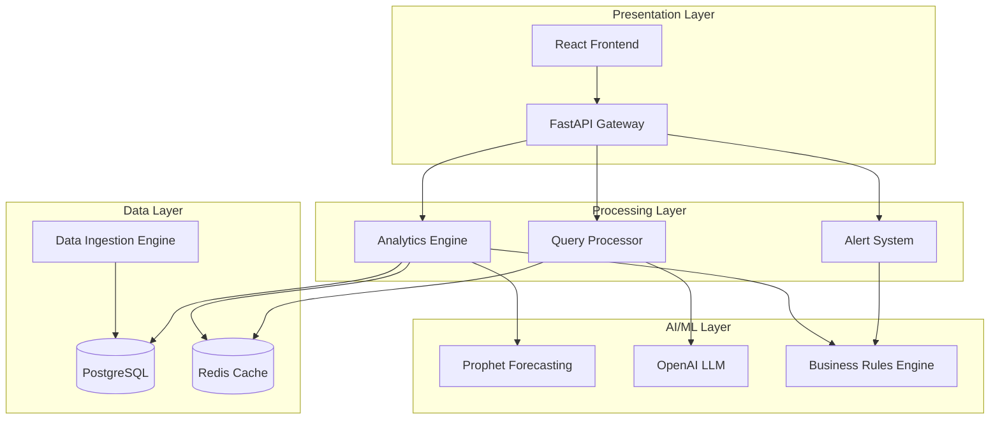

# Design Document: BizPilot AI Copilot

## Overview

BizPilot AI Copilot is a conversational business intelligence system that transforms natural language queries into actionable business insights. The system combines modern NLP techniques with time-series forecasting models to provide inventory intelligence, sales analysis, and profit optimization recommendations for small retail businesses.

The architecture follows a microservices approach with clear separation between data ingestion, natural language processing, analytics computation, and response generation. The system leverages proven AI models (Prophet for time-series forecasting, OpenAI for natural language understanding) while maintaining explainability and fast response times.

## Architecture

The system consists of five main components organized in a layered architecture:



**Key Architectural Decisions:**

1. **Microservices Architecture**: Each major component (NLP, Analytics, Alerts) is independently deployable and scalable
2. **Caching Strategy**: Redis cache for frequently accessed metrics and pre-computed results to meet 3-second response time requirement
3. **Hybrid AI Approach**: Combines rule-based business logic with ML models for reliability and explainability
4. **Event-Driven Processing**: Asynchronous data processing pipeline for CSV ingestion and batch analytics

## Components and Interfaces

### Query Processor (NLP Component)

**Purpose**: Interprets natural language business queries and routes them to appropriate analytics modules.

**Key Interfaces**:
```typescript
interface QueryProcessor {
  parseQuery(query: string): ParsedQuery
  extractEntities(query: string): BusinessEntity[]
  classifyIntent(query: string): QueryIntent
  generateClarification(ambiguousQuery: string): string[]
}

interface ParsedQuery {
  intent: QueryIntent
  entities: BusinessEntity[]
  timeRange: DateRange
  confidence: number
}

enum QueryIntent {
  INVENTORY_STATUS = "inventory_status",
  REORDER_SUGGESTIONS = "reorder_suggestions", 
  PROFIT_ANALYSIS = "profit_analysis",
  SALES_TRENDS = "sales_trends",
  SUPPLIER_PERFORMANCE = "supplier_performance"
}
```

**Implementation Approach**: 
- Uses OpenAI GPT-4 for intent classification and entity extraction
- Maintains a business-specific vocabulary for retail terminology
- Implements confidence thresholds to trigger clarification requests
- Caches common query patterns for faster processing

### Data Ingestion Engine

**Purpose**: Processes and validates CSV files from various business data sources.

**Key Interfaces**:
```typescript
interface DataIngestionEngine {
  validateCSV(file: File, schema: DataSchema): ValidationResult
  processCSV(file: File, businessId: string): ProcessingResult
  getDataStatus(businessId: string): DataStatus
}

interface DataSchema {
  requiredColumns: string[]
  optionalColumns: string[]
  dataTypes: Record<string, DataType>
  validationRules: ValidationRule[]
}

interface ProcessingResult {
  recordsProcessed: number
  errors: DataError[]
  processingTime: number
  dataQualityScore: number
}
```

**Supported Data Formats**:
- Sales Data: date, product_id, quantity_sold, unit_price, total_amount
- Inventory Data: product_id, current_stock, reorder_point, supplier_id
- Purchase Invoices: date, product_id, quantity_purchased, unit_cost, supplier_id

### Analytics Engine

**Purpose**: Core computation engine for business intelligence and forecasting.

**Key Interfaces**:
```typescript
interface AnalyticsEngine {
  calculateProfitMetrics(businessId: string, timeRange: DateRange): ProfitMetrics
  generateInventoryInsights(businessId: string): InventoryInsights
  forecastDemand(productId: string, days: number): DemandForecast
  analyzeSalesTrends(businessId: string, timeRange: DateRange): TrendAnalysis
}

interface InventoryInsights {
  stockoutPredictions: StockoutPrediction[]
  reorderRecommendations: ReorderRecommendation[]
  slowMovingItems: SlowMovingItem[]
  deadStock: DeadStockItem[]
}

interface DemandForecast {
  predictions: DailyPrediction[]
  confidence: number
  seasonalityFactors: SeasonalityFactor[]
  trendDirection: TrendDirection
}
```

**Forecasting Models**:
- **Prophet**: Primary model for demand forecasting with automatic seasonality detection
- **LSTM**: Backup model for complex patterns and short-term predictions
- **Hybrid Approach**: Combines Prophet's interpretability with LSTM's pattern recognition

### Alert System

**Purpose**: Generates proactive notifications and recommendations based on business rules and AI predictions.

**Key Interfaces**:
```typescript
interface AlertSystem {
  generateAlerts(businessId: string): Alert[]
  evaluateBusinessRules(businessData: BusinessData): RuleEvaluation[]
  prioritizeAlerts(alerts: Alert[]): PrioritizedAlert[]
  formatAlertMessage(alert: Alert): AlertMessage
}

interface Alert {
  type: AlertType
  severity: AlertSeverity
  message: string
  recommendations: Recommendation[]
  affectedProducts: string[]
  estimatedImpact: BusinessImpact
}

enum AlertType {
  STOCKOUT_WARNING = "stockout_warning",
  PROFIT_DECLINE = "profit_decline", 
  SUPPLIER_DELAY = "supplier_delay",
  DEAD_STOCK_ALERT = "dead_stock_alert"
}
```

### Response Generator

**Purpose**: Formats analysis results into natural language responses with explanations.

**Key Interfaces**:
```typescript
interface ResponseGenerator {
  generateResponse(analysisResult: AnalysisResult, query: ParsedQuery): NLResponse
  explainRecommendation(recommendation: Recommendation): Explanation
  formatMetrics(metrics: BusinessMetrics): FormattedMetrics
  createVisualization(data: AnalysisData): ChartConfig
}

interface NLResponse {
  answer: string
  explanation: string
  confidence: number
  supportingData: SupportingData[]
  recommendations: Recommendation[]
  visualizations: ChartConfig[]
}
```

## Data Models

### Core Business Entities

```typescript
interface Business {
  id: string
  name: string
  type: BusinessType
  settings: BusinessSettings
  dataStatus: DataStatus
  createdAt: Date
  updatedAt: Date
}

interface Product {
  id: string
  businessId: string
  name: string
  category: string
  sku: string
  unitCost: number
  sellingPrice: number
  currentStock: number
  reorderPoint: number
  supplierId: string
}

interface SalesRecord {
  id: string
  businessId: string
  productId: string
  date: Date
  quantitySold: number
  unitPrice: number
  totalAmount: number
  channel: SalesChannel
}

interface InventoryTransaction {
  id: string
  businessId: string
  productId: string
  date: Date
  type: TransactionType
  quantity: number
  unitCost?: number
  supplierId?: string
  notes?: string
}
```

### Analytics Data Models

```typescript
interface ProfitMetrics {
  totalRevenue: number
  totalCost: number
  grossProfit: number
  profitMargin: number
  productProfitability: ProductProfit[]
  categoryPerformance: CategoryProfit[]
  timeRange: DateRange
}

interface StockoutPrediction {
  productId: string
  currentStock: number
  predictedStockoutDate: Date
  confidence: number
  recommendedReorderQuantity: number
  estimatedLostSales: number
}

interface TrendAnalysis {
  overallTrend: TrendDirection
  growthRate: number
  seasonalPatterns: SeasonalPattern[]
  anomalies: Anomaly[]
  keyInsights: string[]
}
```

Now I need to use the prework tool to analyze the acceptance criteria before writing the Correctness Properties section:
## Correctness Properties

*A property is a characteristic or behavior that should hold true across all valid executions of a system—essentially, a formal statement about what the system should do. Properties serve as the bridge between human-readable specifications and machine-verifiable correctness guarantees.*

### Property 1: Natural Language Query Processing
*For any* valid business query in English, the Query_Processor should successfully parse the intent, extract relevant business entities, and route to the appropriate analysis module with confidence scores above the minimum threshold.
**Validates: Requirements 1.1, 1.5**

### Property 2: Query Error Handling
*For any* ambiguous or unrecognizable query, the system should either request clarification with specific suggestions or provide helpful rephrasing recommendations, never failing silently.
**Validates: Requirements 1.2, 1.4**

### Property 3: System Performance Under Load
*For any* query submitted to the system, response times should be within 3 seconds for cached data and within 5 seconds for 95% of queries under normal load conditions.
**Validates: Requirements 1.3, 6.1, 6.3**

### Property 4: CSV Data Processing
*For any* uploaded CSV file, the Data_Ingestion_Engine should validate format and structure within 10 seconds, process valid data within 30 seconds, and provide specific error messages for invalid data.
**Validates: Requirements 2.1, 2.2, 2.3, 2.5**

### Property 5: Data Format Support
*For any* supported data format (sales, inventory, purchase invoices), the system should successfully process and store the data while maintaining format-specific validation rules.
**Validates: Requirements 2.4**

### Property 6: Inventory Analytics Completeness
*For any* inventory dataset with sufficient historical data, the Analytics_Engine should generate stock-out predictions, reorder recommendations, and identify slow-moving/dead stock with confidence scores and explanations.
**Validates: Requirements 3.1, 3.2, 3.3, 3.5**

### Property 7: Time-Series Forecasting
*For any* product with at least 30 days of historical sales data, the Time_Series_Predictor should generate demand forecasts for the next 30 days with measurable accuracy metrics.
**Validates: Requirements 3.4**

### Property 8: Profit Analysis Accuracy
*For any* sales dataset, the Analytics_Engine should calculate product-wise profit margins, identify trends and seasonal patterns, categorize products by profitability, and account for all costs (purchase, taxes, operational expenses).
**Validates: Requirements 4.1, 4.2, 4.3, 4.4, 4.5**

### Property 9: Alert Generation and Prioritization
*For any* business condition triggering an alert (stock-out risk, profit decline, supplier delays), the Alert_System should generate prioritized notifications with actionable recommendations and impact assessments.
**Validates: Requirements 5.1, 5.2, 5.3, 5.4, 5.5**

### Property 10: User Experience During Processing
*For any* complex analysis or data processing operation, the system should provide progress indicators, partial results when possible, and accurate completion time estimates.
**Validates: Requirements 6.2, 6.5**

### Property 11: Response Explainability
*For any* recommendation, prediction, or analysis result, the Response_Generator should include clear explanations, confidence levels, data source citations, and provide drill-down capabilities with step-by-step calculation breakdowns upon request.
**Validates: Requirements 7.1, 7.2, 7.3, 7.4, 7.5**

### Property 12: Data Security and Isolation
*For any* data operation (upload, storage, processing, querying), the system should maintain encryption in transit and at rest, enforce authentication and role-based access controls, and ensure complete data isolation between business accounts.
**Validates: Requirements 8.1, 8.2, 8.3, 8.5**

### Property 13: Regulatory Compliance
*For any* data handling operation, the system should maintain compliance with data protection regulations and provide complete data deletion capabilities when requested.
**Validates: Requirements 8.4**

### Property 14: Multi-tenant Scalability
*For any* number of concurrent business accounts up to 1,000, the system should maintain performance targets through automatic resource provisioning, parallel processing, efficient data partitioning, and auto-scaling infrastructure.
**Validates: Requirements 9.1, 9.2, 9.3, 9.4, 9.5**

### Property 15: Data Export and Integration
*For any* data export request, the system should provide results in multiple formats (CSV, PDF, JSON), maintain data formatting with metadata, and support API integration with external tools.
**Validates: Requirements 10.1, 10.3, 10.4**

### Property 16: Report Generation and Customization
*For any* report generation request, the system should create formatted business reports with charts and summaries, allowing customization of time periods and metrics.
**Validates: Requirements 10.2, 10.5**

## Error Handling

The system implements comprehensive error handling across all components:

### Data Ingestion Errors
- **Invalid CSV Format**: Provide specific error messages with line numbers and column details
- **Missing Required Fields**: List all missing fields and provide template examples
- **Data Type Mismatches**: Highlight incorrect data types with expected formats
- **File Size Limits**: Graceful handling of oversized files with chunked processing options

### Query Processing Errors
- **Ambiguous Queries**: Request clarification with multiple interpretation options
- **Unsupported Intents**: Provide suggestions for similar supported queries
- **Insufficient Data**: Inform users about minimum data requirements for specific analyses
- **Timeout Errors**: Implement graceful degradation with partial results

### Analytics Errors
- **Insufficient Historical Data**: Provide minimum data requirements and collection guidance
- **Model Prediction Failures**: Fall back to rule-based recommendations with lower confidence
- **Calculation Errors**: Log detailed error information while providing user-friendly messages
- **Resource Exhaustion**: Implement queuing system with estimated wait times

### System-Level Errors
- **Database Connection Issues**: Implement retry logic with exponential backoff
- **External API Failures**: Graceful degradation with cached results when available
- **Authentication Failures**: Clear error messages with account recovery options
- **Rate Limiting**: Inform users of limits with retry timing information

## Testing Strategy

The testing approach combines unit testing for specific scenarios with property-based testing for comprehensive coverage across all possible inputs.

### Unit Testing Focus
- **Integration Points**: Test connections between components (API endpoints, database operations)
- **Edge Cases**: Boundary conditions, empty datasets, malformed inputs
- **Error Conditions**: Specific error scenarios and recovery mechanisms
- **Business Logic Examples**: Concrete examples of profit calculations, forecasting scenarios

### Property-Based Testing Configuration
- **Testing Framework**: Use Hypothesis (Python) for backend services and fast-check (TypeScript) for frontend components
- **Test Iterations**: Minimum 100 iterations per property test to ensure statistical confidence
- **Input Generation**: Custom generators for business data (sales records, inventory levels, CSV formats)
- **Shrinking Strategy**: Implement minimal failing examples for easier debugging

### Property Test Implementation
Each correctness property must be implemented as a property-based test with the following tag format:

```python
# Feature: bizpilot-ai-copilot, Property 1: Natural Language Query Processing
@given(business_queries())
def test_query_processing_completeness(query):
    result = query_processor.parse_query(query)
    assert result.intent is not None
    assert len(result.entities) >= 0
    assert result.confidence >= MINIMUM_CONFIDENCE_THRESHOLD
```

### Performance Testing
- **Load Testing**: Simulate up to 1,000 concurrent users with realistic query patterns
- **Stress Testing**: Test system behavior under resource constraints
- **Endurance Testing**: Long-running tests to identify memory leaks and performance degradation
- **Scalability Testing**: Verify auto-scaling behavior under varying loads

### Security Testing
- **Authentication Testing**: Verify all endpoints require proper authentication
- **Authorization Testing**: Ensure role-based access controls work correctly
- **Data Isolation Testing**: Verify complete separation between business accounts
- **Encryption Testing**: Confirm data encryption in transit and at rest

### Integration Testing
- **End-to-End Workflows**: Complete user journeys from data upload to insights generation
- **External API Integration**: Test OpenAI API integration with various query types
- **Database Integration**: Verify data consistency across all CRUD operations
- **Cache Integration**: Test Redis cache behavior and invalidation strategies